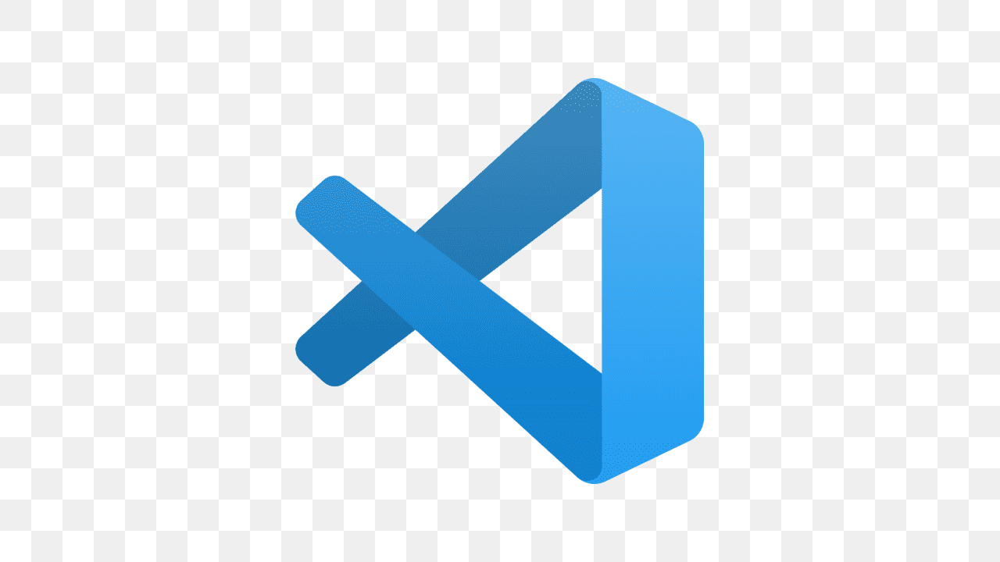

# E-commerce empresa Y

Vamos criar um **e-comerce**, para a *empresa Y* e blablabla

## Funcionalidades

_Checkout, **Tela de Produto**, Catalogo, Home com banner_

###### Melhorias do Projeto

__Melhoria 1__, _melhoria 2_

### Linguagens do projeto

* HTML
* CSS
* JavaScript
* PHP
* MySQL

### Funcionalidades a desenvolver:

1. Área de membros
    1. Login diferente para grupos de cliente
    2. Desconto especial para grupos de cliente
    3. CSS diferente para grupos de cliente
2. Integração com outros pagamentos
3. Sistema de bonus primeira compra

#### Imagem local

